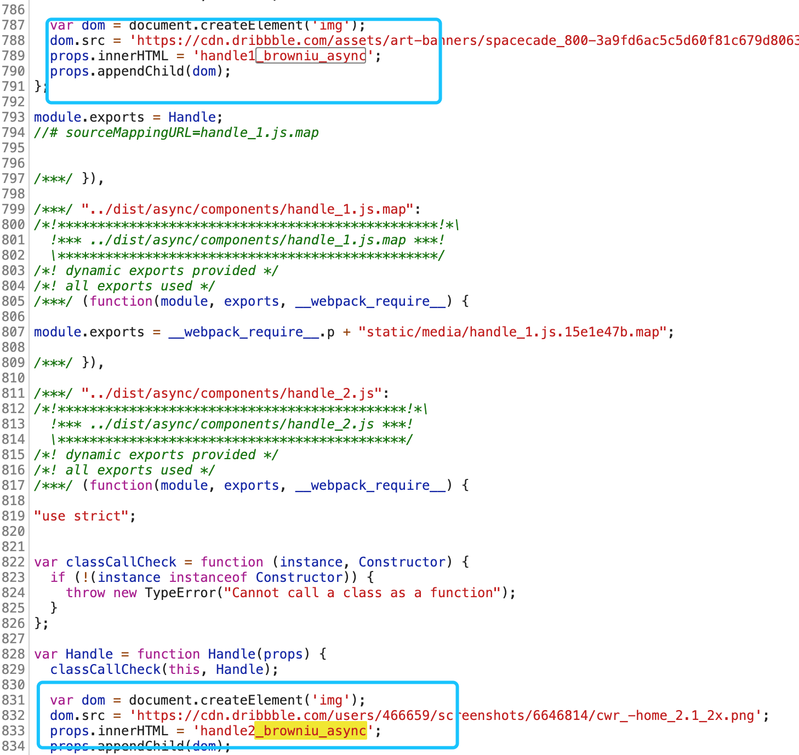
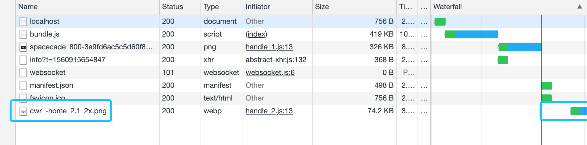

# subpackage

> some methods of subpackgage

[](https://www.npmjs.com/package/subpackage) [](https://standardjs.com)

以下对目前的主要分包方式进行详细的比较

## async

### 引包方式
`import Handle from 'subpackage'`

### 使用方式

```javascript
// App.js
<Handle type="1"/>
```

### 处理机制

```javascript
// subpackage/index.js
import('./components/handle_' + this.props.type).then(Handle => {})
```

根据`props`传值，通过 `import()`动态引入相关的处理方式子组件

### 加载状况
|逻辑代码|静态资源|
|-|-|
|未分离|异步加载|
|||
## License

MIT © [browniu](https://github.com/browniu)
